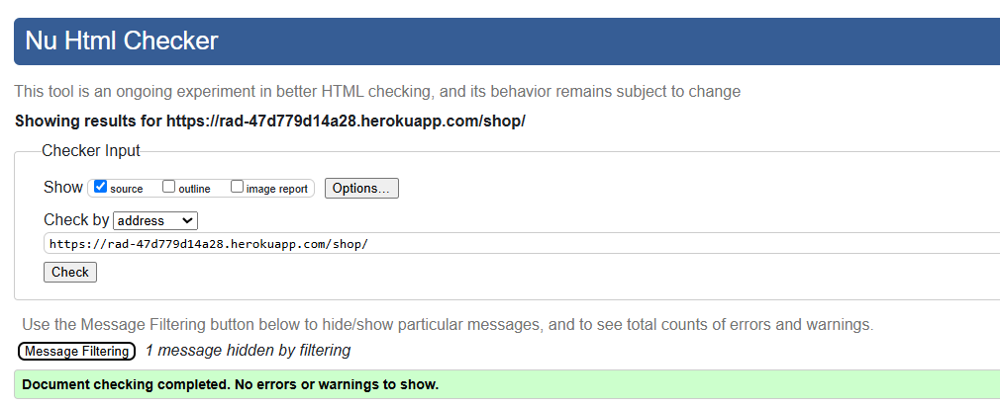
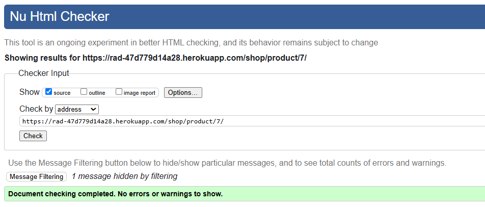
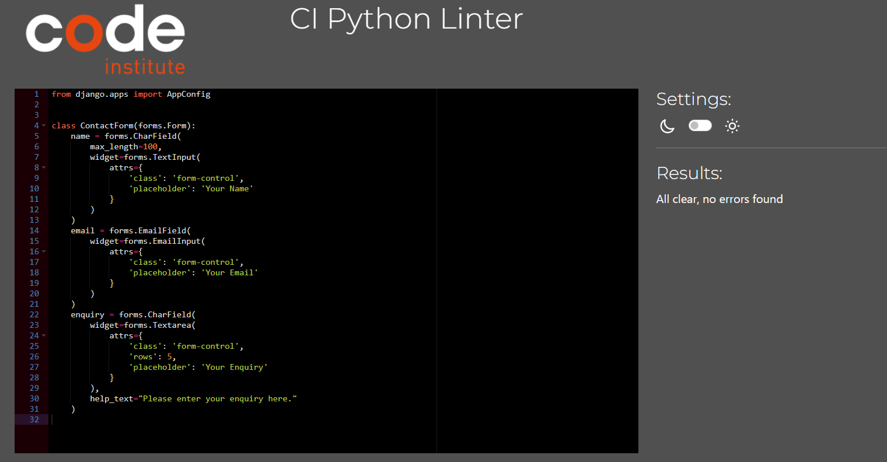
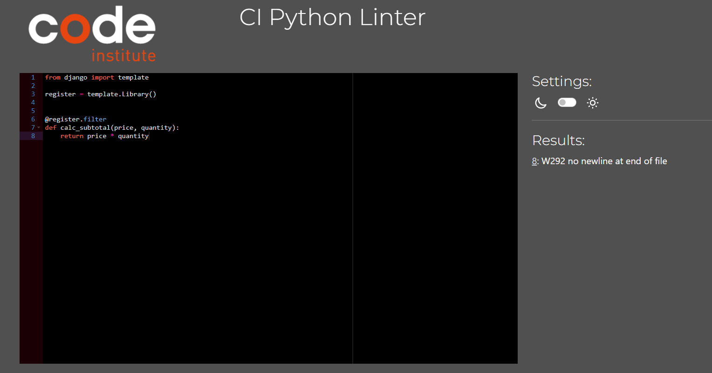

# Testing

Return back to the [README.md](README.md) file.

## Code Validation

### HTML

I have used the recommended [HTML W3C Validator](https://validator.w3.org) to validate all of my HTML files.

| Page | Screenshot | Notes |
| --- | --- | --- |
| 404 |  | Pass: No Errors |
| Home/Base |  | Pass: No Errors, 1 Warning : HTML is compliant, external JS script warning. Inherited throughout site. |
| Shop |  | Pass: No Errors |
| Wholesale |  | Pass: No Errors |
| About |  | Pass: No Errors |
| Contact |  | Pass: No Errors |
| Profile |  | Pass: No Errors |
| Register |  | Pass: No Errors |
| Login |  | Pass: No Errors |
| Product Details |  | Pass: No Errors |
| Edit Review |  | Pass: No Errors |
| Delete Review |  | Pass: No Errors |
| Edit Profile |  | Pass: No Errors |
| Delete Profile |  | Pass: No Errors |
| Order Details |  | Pass: No Errors |
| Logout |  | Pass: No Errors |
| Cart |  | Pass: No Errors |
| Checkout |  | Pass: No Errors |
| Checkout Success |  | Pass: No Errors |
| Email confirm |  | Pass: No Errors |
| Password Change |  | Pass: No Errors |
| Password Reset Done |  | Pass: No Errors |
| Password Reset From Key Done |  | Pass: No Errors |
| Password Reset From Key |  | Pass: No Errors |
| Password Reset |  | Pass: No Errors |
| Verification Sent |  | Pass: No Errors |

### CSS

I have used the recommended [CSS Jigsaw Validator](https://jigsaw.w3.org/css-validator) to validate all of my CSS files.

| File | Screenshot | Notes |
| --- | --- | --- |
| style.css |  | Pass: No Errors |
| checkout.css |  | Pass: No Errors |
| order_details.css |  | Pass: No Errors |

### JavaScript

I have used the recommended [JShint Validator](https://jshint.com) to validate all of my JS files.

| File | Screenshot | Notes |
| --- | --- | --- |
| stripe_elements.js |  | Pass: No Errors |
| cart.js |  | Pass: No Errors |
| quantity.js |  | Pass: No Errors |

### Python

I have used the recommended [PEP8 CI Python Linter](https://pep8ci.herokuapp.com) to validate all of my Python files.

#### Validation For rad App
| File | Screenshot | Notes |
| --- | --- | --- |
| settings.py |  | AUTH_PASSWORD_VALIDATORS lines too long (django code) |
| urls.py |  | Pass: No Errors |

#### Validation For Checkout App
| File | Screenshot | Notes |
| --- | --- | --- |
| init.py |  | Pass: No Errors |
| admin.py |  | Pass: No Errors |
| apps.py |  | Pass: No Errors |
| forms.py |  | Pass: No Errors |
| models.py |  | Pass: No Errors |
| signals.py |  | Pass: No Errors |
| urls.py |  | Pass: No Errors |
| views.py |  | Pass: No Errors |
| webhook_handler.py |  | Pass: No Errors |
| webhooks.py |  | Pass: No Errors |

#### Validation For Accounts App
| File | Screenshot | Notes |
| --- | --- | --- |
| forms.py |  | Pass: No Errors |
| urls.py |  | Pass: No Errors |
| views.py |  | Pass: No Errors |

#### Validation For Core App
| File | Screenshot | Notes |
| --- | --- | --- |
| admin.py |  | Pass: No Errors |
| apps.py |  | Pass: No Errors |
| forms.py |  | Pass: No Errors |
| models.py |  | Pass: No Errors |
| urls.py |  | Pass: No Errors |
| views.py |  | Pass: No Errors |

#### Validation For Shop App
| File | Screenshot | Notes |
| --- | --- | --- |
| cart_tags.py |  | Pass: No Errors |
| shop_tags.py |  | Pass: No Errors |
| admin.py |  | Pass: No Errors |
| apps.py |  | Pass: No Errors |
| context_processors.py |  | Pass: No Errors |
| forms.py |  | Pass: No Errors |
| models.py |  | Pass: No Errors |
| urls.py |  | Pass: No Errors |
| views.py |  | Pass: No Errors |

## Browser Compatibility

I've tested my deployed project on multiple browsers to check for compatibility issues.

| Browser | Screenshot | Notes |
| --- | --- | --- |
| Chrome |  | Works as expected |
| Firefox |  | Works as expected |
| Edge |  | Works as expected |

## Responsiveness

I've tested my deployed project on multiple devices to check for responsiveness issues.

| Device | Screenshot | Notes |
| --- | --- | --- |
| Mobile (DevTools) |  | Works as expected |
| Tablet (DevTools) |  | Works as expected |
| Desktop |  | Works as expected |

## Lighthouse Audit

I've tested my deployed project using the Lighthouse Audit tool to check for any major issues.

### RAD Templates - Mobile Testing
| Page | Size | Screenshot | Notes |
| --- | --- | --- | --- |
| 404 | mobile |  |  |
| Home | mobile |  |  |
| Shop | mobile |  |  |
| Wholesale | mobile |  |  |
| About | mobile |  |  |
| Contact | mobile |  |  |
| Profile | mobile |  |  |
| Register | mobile |  |  |
| Login | mobile |  |  |
| Product Details | mobile |  |  |
| Edit Review | mobile |  |  |
| Delete Review | mobile |  |  |
| Edit Profile | mobile |  |  |
| Delete Profile | mobile |  |  |
| Order Details | mobile |  |  |
| Logout | mobile |  |  |
| Cart | mobile |  |  |
| Checkout | mobile |  |  |
| Checkout Success | mobile |  |  |
| Base | mobile |  |  |
| Account Base | mobile |  |  |
| Email confirm | mobile |  |  |
| Password Change | mobile |  |  |
| Password Reset Done | mobile |  |  |
| Password Reset From Key Done | mobile |  |  |
| Password Reset From Key | mobile |  |  |
| Password Reset | mobile |  |  |
| Verification Sent | mobile |  |  |
| Verified Email Required | mobile |  |  |
| Toast Error | mobile |  |  |
| Toast Info | mobile |  |  |
| Toast Success | mobile |  |  |
| Toast Warning | mobile |  |  |

### RAD Templates - Desktop Testing
| Page | Size | Screenshot | Notes |
| --- | --- | --- | --- |
| 404 | desktop |  |  |
| Home | desktop |  |  |
| Shop | desktop |  |  |
| Wholesale | desktop |  |  |
| About | desktop |  |  |
| Contact | desktop |  |  |
| Profile | desktop |  |  |
| Register | desktop |  |  |
| Login | desktop |  |  |
| Product Details | desktop |  |  |
| Edit Review | desktop |  |  |
| Delete Review | desktop |  |  |
| Edit Profile | desktop |  |  |
| Delete Profile | desktop |  |  |
| Order Details | desktop |  |  |
| Logout | desktop |  |  |
| Cart | desktop |  |  |
| Checkout | desktop |  |  |
| Checkout Success | desktop |  |  |
| Base | desktop |  |  |
| Account Base | desktop |  |  |
| Email confirm | desktop |  |  |
| Password Change | desktop |  |  |
| Password Reset Done | desktop |  |  |
| Password Reset From Key Done | desktop |  |  |
| Password Reset From Key | desktop |  |  |
| Password Reset | desktop |  |  |
| Verification Sent | desktop |  |  |
| Verified Email Required | desktop |  |  |
| Toast Error | desktop |  |  |
| Toast Info | desktop |  |  |
| Toast Success | desktop |  |  |
| Toast Warning | desktop |  |  |

## Defensive Programming

Defensive programming was manually tested with the below user acceptance testing:

| Page | User Action | Expected Result | Pass/Fail | Comments |
| --- | --- | --- | --- | --- |
| Nav links | | | | |
| | Click on Logo | Redirection to Home page | Pass | |
| | Click on Home link in navbar | Redirection to Home page | Pass | |
| | Click on Shop link in navbar | Redirection to Shop page | Pass | |
| | Click on Wholesale link in navbar | Redirection to Wholesale page | Pass | |
| | Click on About link in navbar | Redirection to About page | Pass | |
| | Click on Shop link in navbar | Redirection to Shop page | Pass | |
| | Click on Contact link in navbar | Redirection to Contact page | Pass | |
| | Click on Profile link in navbar | Redirection to Profile page | Pass | |
| | Click on Login link in navbar | Redirection to Login page | Pass | |
| | Click on Sign Up link in navbar | Redirection to Sign Up page | Pass | |
| | Click on Log Out link in navbar | Log out and Redirection to Home page | Pass | |
| | Enter product in Search Bar | Redirects to Products in the Shop page | Pass | |
| | Click on Cart link in navbar | Redirects to Cart page | Pass | |
| | Click on Social links in Footer | Redirection to corresponding social page | Pass | |
| Home page | | | | |
| | Click on Sho Now button on hero image | Redirection to Shop page | Pass | |
| | Click on Show Me button | Redirection to Shop page | Pass | |
| | Click on product Shop Now button | Redirection to that products detail page | Pass | |
| | Click on Shop Wholesale button | Redirection to Wholesale page | Pass | |
| Shop | | | | |
| | Click on any products View Details button | Redirection to that products details page | Pass | |
| | Select filter preferences and click Apply Filters | Filters products based on search | Pass | |
| | Click on any products Image | Redirection to that products details page | Pass | |
| | Click on any products Add To Cart button | Adds product to cart and toast displays | Pass | |
| Product Details Details Page | | | | |
| | Click on quantity selector buttons | Increases or decreases quantity | Pass | |
| | Click on Add To Cart button | Adds product to cart and toast displays | Pass | |
| | Click on any products Add To Cart button | Adds product to cart and toast displays | Pass | |
| | Click on star rating box | Dropdown bow with star ratings appears | Pass | |
| | Enter text in review box and click Submit Review | Adds review to page and toast confirmation | Pass | |
| | Click Edit button on own review | Redirects to Edit Review page | Pass | |
| | Click Delete button on own review | Redirects to Delete Review page | Pass | |
| | Click Back To Shop button | Redirects to Shop page | Pass | |
| Edit Review Page | | | | |
| | Click on star rating box | Dropdown bow with star ratings appears | Pass | |
| | Enter text in review box and click Update Review | Updates review on page, redirects to product detail page and toast message | Pass | |
| | Click Cancel button | Redirects to Product Details page | Pass | |
| Delete Review Page | | | | |
| | Click Yes, Delete button | Removes review and redirect to Product Detail page | Pass | |
| | Click on Cancel button | Redirect to Product Detail page | Pass | |
| Wholesale Page | | | | |
| | Click on Contact Us button | Redirect to Contact page | Pass | |
| Contact Page | | | | |
| |  Enter name | Redirect to Contact Form | Pass | |
| |  Enter valid email address | Redirect to Contact Form | Pass | |
| | Enter message | Redirect to Contact Form | Pass | |
| | Click on Submit button | Redirect to Contact page and toast message | Pass | |
| | Click on Google Map | Navigates as it should | Pass | |
| Sign In Page | | | | |
| | Enter valid Email Address | Field will only accept registered users | Pass | |
| | Enter valid password | Field will only accept password format | Pass | |
| | Click on Sign In button | Redirects user to Home page with toast message | Pass |
| | Click on Forgot Password button | Redirects user to Password Reset page | Pass |
| Password Reset Page | | | | |
| | Enter valid Email Address | Field will only accept registered users | Pass | |
| | Click on Back to Login button | Redirects user to Sign In page | Pass |
| | Click on Reset My Password button | Redirects user to Password Reset Submitted page | Pass |
| Password Change Page | | | | |
| | Enter Password | 2 boxes and the passwords need to match | Pass | |
| | Click on Back to Login button | Redirects user to Sign In page | Pass |
| | Click on Change Password button | Redirects user to Password Reset Done page | Pass |
| Password Reset Done Page | | | | |
| | Click on Back To Login button | Redirects user to Sign In page | Pass |
| Register Page | | | | |
| | Enter valid Email Address | Field will only accept email format | Pass | |
| | Enter valid password (twice) | Field will only accept password format | Pass | |
| | Click Sign Up button | Redirects user to Verify Your Email page with toast message | Pass | |
| Confirm Email Address Page | | | | |
| | Click Confirm button | Redirects to Sign In page with toast message | Pass | |
| Log Out Page | | | | |
| | Click Yes, Log Me Out button | Logs out user, Redirects user to Home page | Pass |
| | Click Cancel button | Keeps user logged in, redirects to Home page | Pass |
| Profile Page | | | | |
| | Click on the Update Profile button | Redirects to Edit Profile page | Pass | |
| | Click on the Delete My Account button | Redirects to Delete Account Confirmation page | Pass | |
| | Click on the View button on an order | Redirects to Order Details page | Pass | |
| Edit Profile Page | | | | |
| | Enter user details | Field will only accept email format | Pass | |
| | Click on the Save Changes button | Redirects to Profile page | Pass | |
| | Click on the Cancel button | Redirects to Profile page | Pass | |
| Delete Account Confirmation Page | | | | |
| | Click on the Delete My Account button | Deletes account and redirects to Home page | Pass | |
| | Click on the Cancel button | Redirects to Profile page without deleting account | Pass | |
| Order Details Page | | | | |
| | Click on the Back To Profile button | Redirects to Profile page | Pass | |
| Cart Page | | | | |
| | (With product in added to cart) change number in quantity box and click Update button | Updates quantity | Pass | |
| | (With product in added to cart) click Remove button | Removes product from cart | Pass | |
| | Click on Proceed To Checkout button | Redirects to Checkout page | Pass | |
| Checkout Page | | | | |
| | Enter user details | Field will only accept email format | Pass | |
| | Click on Product Image | Redirects to Products details page | Pass | |
| | Click on the Adjust Cart button | Redirects to Cart page | Pass | |
| | Click on the Complete Order button | Redirects to Checkout Success page with toast message | Pass | |
| Checkout Success Page | | | | |
| | Click Continue Shopping button | Redirects to Shop page | Pass | |
| Site Navigations - Logged Out User | | | | |
| | Navigate to any login required URL | Give option to Login or Sign Up | Pass | |

## User Story Testing

| User Story | Screenshot |
| --- | --- |
| As a user, I want to browse products by category so that I can easily find items of interest. |  |
| As a user,  I want to search for products using keywords so that I can quickly find specific items. |  |
| As a user, I want to view detailed product information so that I can make informed purchase decisions. |  |
| As a user, I want to add products to my shopping cart so that I can review them before purchasing. |  |
| As a user, I want to register an account so that I can save my details for future purchases. |  |
| As a user, I want to log in and log out securely so that my account remains private. |  |
| As a user, I want to update my profile information so that I can keep my account details current. |  |
| As a user, I want to leave reviews on products so that I can share my feedback with others. |  |
| As a user, I want a secure and streamlined checkout process so that I can complete my purchase with confidence. |  |
| As a user, I want to receive an order confirmation email so that I have a record of my purchase. |  |
| As a user, I want to contact customer support directly through the website so that I can resolve any issues promptly. |  |
| As a user, I want to view my order history so that I can review past purchases. |  |
| As an admin, I want to log in to the admin dashboard so that I can manage the site securely. |  |
| As a user, |  |
| As an admin, I want to perform CRUD operations on products so that I can manage the catalog effectively. |  |
| As an admin, I want to manage user accounts so that I can control access and maintain security. |  |
| As an admin, I want to manage orders so that I can oversee the entire order lifecycle. |  |
| As an admin, I want to manage inventory so that I can keep product stock up to date. |  |
| As an admin, I want to respond to customer inquiries so that issues are resolved quickly. |  |

## Bugs

- Navbar items wouldn't align on right.

    - To fix this, I had to remove css for header display:flex for them to align to the right.

- Raw html showing on homepage cards.

    

    - To fix this, I had to add 'safe' to base home.html

- Card buttons not staying at the bottom.

    

    - To fix this, I wrapped the card contents in a separate div and added css to the button : margin-top: auto;

- Logo not showing.

    

    - To fix this, I had to resize the logo image as the file size was too large.

- Footer not staying fixed to the bottom of the page on soame pages.

    

    - To fix this I had to set the .homepage height to 100vh.

- Extra zeros being displayed on prices.

    - To fix this, I had to add a float format so new code is: 
<strong>Price:</strong> £{{ itinerary.price|floatformat:"0" }}pp
 anywhere there was a price.

- Too many itineraries showing in the features section.

    - To fix this, I had to add 'slice' to  in the home.html file so that it will now only display 6.

## Unfixed Bugs

There are no remaining bugs that I am aware of.